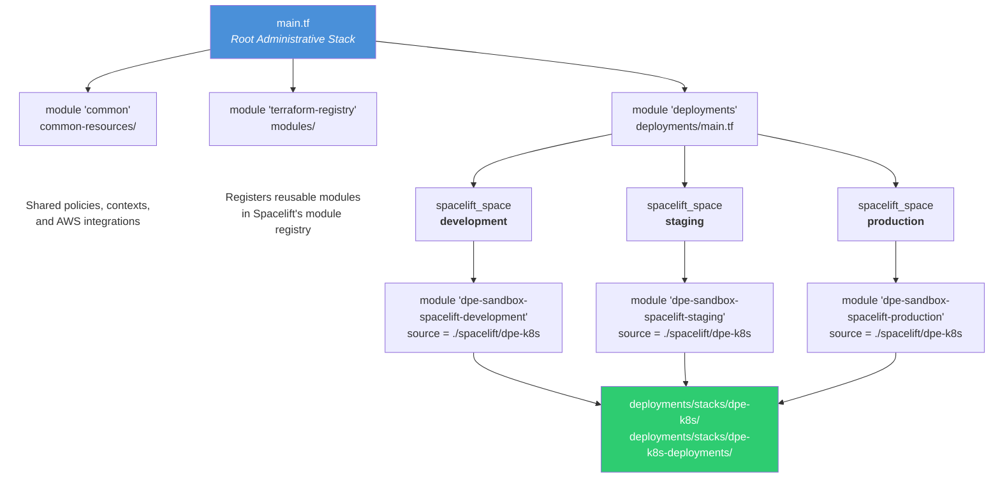

# Purpose

This repo manages cloud infrastructure deployed to AWS via [Spacelift](https://spacelift.io/) CI/CD using [OpenTofu](https://opentofu.org/). While originally focused on EKS, it now also manages additional AWS services including S3, and SES.

## Directory Structure
```
eks-stack/
  main.tf                      # Root Spacelift administrative stack
  provider.tf                  # Spacelift provider config
  common-resources/            # Shared Spacelift policies, contexts, AWS integrations
  deployments/
    main.tf                    # Wires spacelift pipeline configs per environment (dev/staging/prod)
    spacelift/                 # CI pipeline definitions (HOW things get deployed)
      dpe-k8s/                 # Pipeline config for EKS stacks
    stacks/                    # Cloud resource definitions (WHAT gets deployed)
      dpe-k8s/                 # VPC, EKS cluster, SES, S3 buckets
      dpe-k8s-deployments/     # K8s-internal: ArgoCD, Airflow, monitoring, etc.
  modules/                     # Reusable Terraform modules
  docs/                        # Workshop materials
  scripts/                     # Utility scripts
```

## Prerequisites

Before modifying modules, stacks, or configs:

1. **Spacelift access** — Request access to the [Spacelift UI](https://sagebionetworks.app.spacelift.io/) from Lingling or Bryan
2. **AWS SSO** — Configure SSO profiles for the target AWS accounts (see [Connecting to an EKS Cluster](#connecting-to-an-eks-cluster))
3. **OpenTofu** — Install [OpenTofu](https://opentofu.org/docs/intro/install/) for local development/testing
4. **kubectl** (optional) — For Kubernetes cluster access, install [kubectl](https://kubernetes.io/docs/tasks/tools/)

## Development Guidelines

### Branch Targeting and deployments/main.tf Changes

⚠️ **Important**: Don't introduce changes to `deployments/main.tf` unless your branch is pointed at `main`.

When working on feature branches that target other feature branches (rather than `main`), Spacelift may not recognize changes to `deployments/main.tf` because it reads configuration from the targeted branch. This can cause variable resolution errors where required variables appear undefined even though they're properly configured in your branch.

## How Deployment Works

Deploying a resource involves a **two-step process**:

1. **`deployments/spacelift/<name>/`** defines the **CI pipeline** in Spacelift. This controls _which_ stacks can be deployed, to _which_ AWS account, with _what_ environment variables. Think of this as the build server job configuration.

2. **`deployments/stacks/<name>/`** defines **what cloud resources** are provisioned when that pipeline runs. Each stack is a Terraform root module that typically sources reusable modules from `modules/`. Think of this as the infrastructure blueprint.

When Spacelift runs a pipeline, it executes `tofu plan/apply` against the corresponding stack directory.

### Architecture Diagram



## When to Add a Module vs. Create a New Stack

| Scenario | Where to Add | Example |
|----------|--------------|---------|
| Kubernetes application/service that runs inside the EKS cluster | Add module to `deployments/stacks/dpe-k8s-deployments/` | ArgoCD, Airflow, monitoring tools |
| Core AWS infrastructure or EKS cluster configuration | Add module to `deployments/stacks/dpe-k8s/` | VPC, EKS addons, S3 buckets |
| Independent resource with its own deployment lifecycle | Create a new stack (follow "Adding a New Stack" below) | Standalone SES config, separate API Gateway |

**Rule of thumb:** If your resource needs to be deployed/destroyed independently from the EKS cluster, create a new stack. If it's a Kubernetes workload, add it to `dpe-k8s-deployments`. If it's AWS infrastructure that the cluster depends on, add it to `dpe-k8s`.

## Adding a New Stack

Follow these steps to add a new independently-deployed resource:

### 1. Create the Terraform module

Create a new directory in `modules/<your-module>/` with at minimum:
- `main.tf` - the cloud resources to create
- `variables.tf` - configurable inputs
- `outputs.tf` - values other stacks may need
- `versions.tf` - required providers

See the [modules README](./modules/README.md) for guidelines.

### 2. Create the deployment stack

Create a new directory in `deployments/stacks/<your-stack>/` with:
- `main.tf` - sources your module: `source = "../../../modules/<your-module>"`
- `variables.tf` - environment-specific inputs (passed as `TF_VAR_*` from Spacelift)
- `outputs.tf` - values to export
- `provider.tf` - AWS provider configuration
- `versions.tf` - required providers and OpenTofu version

### 3. Create the Spacelift pipeline config

Create a new directory in `deployments/spacelift/<your-stack>/` with:
- `main.tf` - defines:
  - `spacelift_space` - a logical grouping in Spacelift
  - `spacelift_stack` - points `project_root` to your stack directory
  - `spacelift_environment_variable` - passes `TF_VAR_*` variables
  - `spacelift_aws_integration_attachment` - binds AWS credentials
- `variables.tf` - inputs from the parent module
- `outputs.tf` - stack IDs for reference
- `versions.tf` - Spacelift provider


### 4. Wire it into `deployments/main.tf`

Add a `module` block in `deployments/main.tf` that sources your new spacelift config and passes the required variables (`parent_space_id`, `admin_stack_id`, `aws_integration_id`, `git_branch`, etc.).

### 5. Commit, PR, merge

Once merged to `main`, the root administrative stack detects the changes and creates the new Spacelift stacks automatically.

### 6. View your new resources

To see your newly created stacks and monitor deployments:

- **Spacelift UI** — Log into the [Spacelift UI](https://sagebionetworks.app.spacelift.io/) to view stacks, runs, and logs. As of February 2026, a common DPE team account has not been created — contact Lingling or Bryan for access.
- **AWS Console** — Log into the [AWS Console via JumpCloud](https://console.jumpcloud.com/userconsole#/) for the target account to view the deployed cloud resources directly.

## Modules

Reusable Terraform modules in `modules/`:

**AWS Infrastructure**
- `sage-aws-vpc` - VPC with public/private subnets
- `sage-aws-eks` - EKS cluster provisioning
- `sage-aws-eks-addons` - Post-creation EKS addons (CoreDNS, EBS CSI, GuardDuty)
- `sage-aws-ses` - Simple Email Service setup
- `s3-bucket` - S3 bucket with optional public access and IRSA

**Kubernetes Cluster Management**
- `sage-aws-k8s-node-autoscaler` - Node autoscaling via Spot.io Ocean
- `cert-manager` - TLS certificate provisioning
- `envoy-gateway` - API Gateway with TLS termination

**Application Deployment (K8s)**
- `apache-airflow` - Workflow orchestration
- `argo-cd` - GitOps continuous delivery
- `flux-cd` - Alternative GitOps tool
- `postgres-cloud-native` - PostgreSQL instance via CloudNativePG
- `postgres-cloud-native-operator` - CloudNativePG operator

**Monitoring and Security**
- `victoria-metrics` - Prometheus-compatible metrics collection
- `trivy-operator` - Container security scanning

**API and Messaging**
- `aws-api-gateway` - API Gateway resources
- `aws-sqs` - Simple Queue Service

**CI/CD**
- `spacelift-private-worker` - Spacelift private worker setup

**Demos**
- `demo-network-policies` - Kubernetes network policy examples
- `demo-pod-level-security-groups-strict` - Pod-level security group examples

---

## EKS Cluster Documentation

The following sections apply specifically to the EKS cluster stacks (`dpe-k8s` and `dpe-k8s-deployments`).

### AWS VPC
The VPC is created with the [AWS VPC Terraform module](https://registry.terraform.io/modules/terraform-aws-modules/vpc/aws/latest). It contains a number of defaults for our use-case at Sage. See the module definition for details.

### AWS EKS

[AWS EKS](https://aws.amazon.com/eks/) is a managed Kubernetes cluster. We provide configurable parameters to run workloads on top of it.

#### EKS API Access
API access to the Kubernetes cluster endpoint is set to `Public and private`.

Reading:
- <https://github.com/terraform-aws-modules/terraform-aws-eks/blob/master/docs/network_connectivity.md>

**Public:** Allows connections via `kubectl` from outside the VPC. Access is secured using a combination of AWS IAM and native Kubernetes RBAC.

**Private:** All communication between worker nodes and the API server stays within the VPC. You can limit the IP addresses that can access the API server from the internet, or completely disable internet access to it.

### EKS VPC CNI Plugin
The VPC CNI (Container Network Interface) plugin allocates VPC IP addresses to Kubernetes nodes and configures networking for Pods on each node.

### Security Groups for Pods
Allows assigning EC2 security groups directly to pods running in EKS. This can be used as an alternative or in conjunction with Kubernetes network policies.

See `modules/demo-pod-level-security-groups-strict` for an example.

### Kubernetes Network Policies
Controls network traffic within the cluster (e.g., pod-to-pod traffic).

See `modules/demo-network-policies` for an example.

Further reading:
- https://docs.aws.amazon.com/eks/latest/userguide/cni-network-policy.html
- https://docs.aws.amazon.com/eks/latest/userguide/security-groups-for-pods.html
- https://aws.amazon.com/blogs/containers/introducing-security-groups-for-pods/
- https://kubernetes.io/docs/concepts/services-networking/network-policies/

### EKS Autoscaler

We use [Spot.io](https://spot.io/) to manage EKS cluster nodes. It has scale-to-zero capabilities and dynamically adds or removes nodes based on demand. The autoscaler is provided as a Terraform module (`sage-aws-k8s-node-autoscaler`).

**Spot.io setup (manual, per AWS account):**

1. Subscribe through the AWS Marketplace: <https://aws.amazon.com/marketplace/saas/ordering?productId=bc241ac2-7b41-4fdd-89d1-6928ec6dae15>
2. "Set up your account" on the Spot.io website and link it to an existing organization
3. Link the account through the AWS UI:
   - Create a policy (see the JSON in the Spot.io UI)
   - Create a role (see instructions in the Spot.io UI)
4. Get an API token:
   - Log into the Spot UI: <https://console.spotinst.com/settings/v2/tokens/permanent>
   - Create a new Permanent token named `{AWS-Account-Name}-token`
   - Copy the token and create an `AWS Secrets Manager` Plaintext secret named `spotinst_token` with description `Spot.io token`

### Connecting to an EKS Cluster

To connect via `kubectl`, ensure you have SSO set up for the target account:

```bash
# Login with your SSO profile (e.g., dpe-prod-admin)
aws sso login --profile dpe-prod-admin

# Update kubeconfig to authenticate using the SSO profile and assume the eks_admin_role
aws eks update-kubeconfig --region us-east-1 --name dpe-k8 --profile dpe-prod-admin
```

### Security and Audits

AWS GuardDuty provides audit trails for the EKS cluster with two components:
1. [EKS Audit Log Monitoring](https://docs.aws.amazon.com/guardduty/latest/ug/guardduty-eks-audit-log-monitoring.html)
2. [GuardDuty Runtime Monitoring](https://docs.aws.amazon.com/guardduty/latest/ug/runtime-monitoring-configuration.html)

Initial configuration is handled through the `securitycentral` IT account. Runtime Monitoring is installed via Terraform modules so it can be torn down with the VPC and EKS cluster.

We also use the [trivy-operator](https://github.com/aquasecurity/trivy-operator) for Kubernetes-native security scanning. As resources are deployed, Trivy generates vulnerability reports. [policy-reporter](https://github.com/kyverno/policy-reporter) provides a UI for reviewing results. SBOM (Software Bill of Materials) reports are used to track security advisories.

### Deploying Applications to the Cluster

Deployment of applications to the Kubernetes cluster uses Terraform, Spacelift, and ArgoCD or FluxCD.

#### Creating the Terraform module

See the [modules README](./modules/README.md) for supplemental information.

1. Create a new directory in `./modules` named after what you are deploying
2. At minimum define `main.tf` and `versions.tf` with the cloud resources and required providers
3. Add any additional [files](https://opentofu.org/docs/language/files/) and [resources](https://opentofu.org/docs/language/resources/syntax/) as needed

#### Deploying via ArgoCD

[ArgoCD](https://argo-cd.readthedocs.io/en/stable/) is a declarative GitOps continuous delivery tool for Kubernetes. It continuously monitors Kubernetes resources to align expected state with actual state, with support for Helm charts and Kubernetes YAML files.

The [declarative setup](https://argo-cd.readthedocs.io/en/stable/operator-manual/declarative-setup/#declarative-setup) uses [ArgoCD CRDs](https://github.com/argoproj/argo-cd/tree/master/manifests/crds). We typically create an [Application Specification](https://argo-cd.readthedocs.io/en/stable/user-guide/application-specification/) and use [Multiple Sources for an Application](https://argo-cd.readthedocs.io/en/stable/user-guide/multiple_sources/) to install public Helm charts with custom `values.yaml` files. See the [Apache Airflow module README](./modules/apache-airflow/README.md) for a real example.

### Accessing Resources on the Cluster

As of August 2024, access to resources on the Kubernetes cluster is through `kubectl port-forward` sessions. No internet-facing load balancers are available.

Using a tool like [K9s](https://k9scli.io/), navigate to the pod and start a port-forward session, then open `localhost` at the specified port in your browser.

(Future work for better secrets management: https://sagebionetworks.jira.com/browse/IBCDPE-1038)

Most resources have a login page requiring username and password stored as base64-encoded Kubernetes secrets:
- **ArgoCD:** Secret `argocd-initial-admin-secret`, username `admin`
- **Grafana:** Secret `victoria-metrics-k8s-stack-grafana`, username `admin`

### Authenticated Docker Pulls

We use a DPE service account (`dpesagebionetworks`) to authenticate Docker Hub pulls, avoiding anonymous rate limits.

Setup steps:
1. Log into Docker Hub with credentials stored in LastPass
2. Create a new Personal Access Token
3. Add it to the Spacelift "Kubernetes Deployments" stack as `TF_VAR_docker_access_token`
4. Add the variable to `variables.tf` in the relevant module
5. Add a Kubernetes secret to `main.tf` for each namespace needing authenticated pulls
6. Update Helm charts to reference the secret per [this guide](https://kubernetes.io/docs/tasks/configure-pod-container/pull-image-private-registry/)
7. Deploy via Terraform and apply via ArgoCD or FluxCD

`variables.tf`:
```terraform
variable "docker_server" {
  description = "The docker registry URL"
  default     = "https://index.docker.io/v1/"
  type        = string
}

variable "docker_username" {
  description = "Username to log into docker for authenticated pulls"
  default     = "dpesagebionetworks"
  type        = string
}

variable "docker_access_token" {
  description = "The access token to use for docker authenticated pulls. Created via by setting 'TF_VAR_docker_access_token' within spacelift as an environment variable"
  type        = string
}

variable "docker_email" {
  description = "The email for the docker account"
  default     = "dpe@sagebase.org"
  type        = string
}
```

`main.tf`:
```terraform
resource "kubernetes_secret" "docker-cfg" {
  metadata {
    name      = "docker-cfg"
    namespace = var.namespace
  }

  type = "kubernetes.io/dockerconfigjson"

  data = {
    ".dockerconfigjson" = jsonencode({
      auths = {
        "${var.docker_server}" = {
          "username" = var.docker_username,
          "password" = var.docker_access_token,
          "email"    = var.docker_email
          "auth"     = base64encode("${var.docker_username}:${var.docker_access_token}")
        }
      }
    })
  }
}
```

### Tearing Down EKS Stacks

To fully tear down EKS infrastructure, destroy in this order:
1. Go into the ArgoCD UI and delete all applications
2. Run `tofu destroy --auto-approve` as a task in Spacelift for the Kubernetes Deployments stack
3. Run `tofu destroy --auto-approve` as a task in Spacelift for the Infrastructure stack

---

## Spacelift Setup

### Connecting a New AWS Account

Reference: <https://docs.spacelift.io/integrations/cloud-providers/aws#setup-guide>

1. Create a new IAM role (e.g., `spacelift-admin-role`) with description: "Role for Spacelift CI/CD to assume when deploying resources managed by Terraform"
2. Use this custom trust policy:

```json
{
    "Version": "2012-10-17",
    "Statement": [
        {
            "Effect": "Allow",
            "Principal": {
                "AWS": "arn:aws:iam::324880187172:root"
            },
            "Action": "sts:AssumeRole",
            "Condition": {
                "StringLike": {
                    "sts:ExternalId": "sagebionetworks@*"
                }
            }
        },
        {
            "Effect": "Allow",
            "Principal": {
                "AWS": "arn:aws:iam::{{AWS ACCOUNT ID}}:root"
            },
            "Action": "sts:AssumeRole"
        }
    ]
}
```

3. Attach these policies to the role:
   - `PowerUserAccess`
   - An inline policy for IAM operations (needed if Terraform creates/edits/deletes IAM roles/policies):

```json
{
    "Version": "2012-10-17",
    "Statement": [
        {
            "Effect": "Allow",
            "Action": [
                "iam:*Role",
                "iam:*RolePolicy",
                "iam:*RolePolicies",
                "iam:*Policy",
                "iam:*PolicyVersion",
                "iam:*OpenIDConnectProvider",
                "iam:*InstanceProfile",
                "iam:ListPolicyVersions",
                "iam:UpdateOpenIDConnectProviderThumbprint",
                "iam:ListGroupsForUser",
                "iam:ListAttachedUserPolicies"
            ],
            "Resource": "*"
        },
        {
            "Effect": "Allow",
            "Action": [
                "iam:CreateUser",
                "iam:AttachUserPolicy",
                "iam:ListPolicies",
                "iam:TagUser",
                "iam:GetUser",
                "iam:DeleteUser",
                "iam:CreateAccessKey",
                "iam:ListAccessKeys",
                "iam:DeleteAccessKey"
            ],
            "Resource": "arn:aws:iam::{{AWS ACCOUNT ID}}:user/smtp_user"
        }
    ]
}
```

4. Add a new `spacelift_aws_integration` resource to the `common-resources/aws-integrations` directory.
