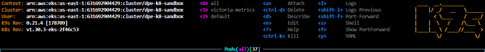
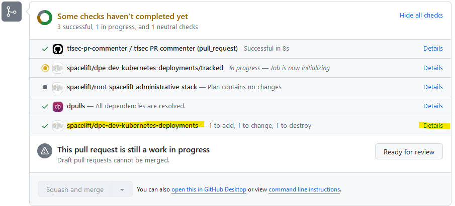

# Purpose
This is meant to be a small workshop that explores deploying a hello world application
to the AWS EKS Kubernetes cluster, as well as exploring a few items available within
the cluster.

## Pre-Req
- Install a tool to access the cluster in a user friendly way such as: https://k9scli.io/
- Set up a SSO login session to access the cluster and login, for example: https://sagebionetworks.jira.com/wiki/spaces/IT/pages/2632286259/AWS+SSM+Session+Manager#%5CuD83D%5CuDCD8-Log-in-to-an-AWS-account
  - `aws sso login --profile dnt-dev-admin`
- Update your kubeconfig to connect to the cluster:
    - `aws eks update-kubeconfig --region us-east-1 --name dpe-k8-sandbox --profile dnt-dev-admin`
- In your cli start k9s
    - `k9s`

If everything is correct you should see a screen like:


### Deploy out hello-world
- Create a new branch in git to push your changes to
- Open up `deployments/stacks/dpe-k8s-deployments/main.tf`
  - You'll notice a bunch of modules. These are the resources we are already deploying to the kubernetes cluster, wrapped in something called a "module"
  - For this tutorial we will create the resource files directly here for simplicity
- Create 2 sections in the file:

1) A namespace: <https://kubernetes.io/docs/concepts/overview/working-with-objects/namespaces/>

Update `my-cool-resource` and `my-cool-namespace` to whatever values you'd like. In this
case `my-cool-resource` is the identifier in which terraform is referencing this specific
resource. `my-cool-namespace` on the otherhand is the name of the namespace you'll be
creating within the kubernetes cluster.

```
resource "kubernetes_namespace" "my-cool-resource" {
  metadata {
    name = "my-cool-namespace"
  }
}
```

2) A Deployment: https://kubernetes.io/docs/concepts/workloads/controllers/deployment/

You'll want to update the reference to your terraform namespace resource here here:

- If you updated the terraform identifier `my-cool-resource` to something else, make sure they match
```
resource "kubectl_manifest" "my-deployment" {
  depends_on = [kubernetes_namespace.my-cool-resource]

  yaml_body = <<YAML
apiVersion: apps/v1
kind: Deployment
metadata:
  namespace: ${kubernetes_namespace.my-cool-resource.metadata.0.name}
  name: flask-dep
  labels:
    app: flask-helloworld
spec:
  replicas: 1
  selector:
    matchLabels:
      app: flask-helloworld
  template:
    metadata:
      labels:
        app: flask-helloworld
    spec:
      containers:
      - name: flask
        image: digitalocean/flask-helloworld:latest
        ports:
        - containerPort: 5000
YAML
}
```

- Commit the changes and push the changes to github
- Create a pull request to main
- In the git checks that run you'll see a section that says something like: `spacelift/dpe-dev-kubernetes-deployments — 2 to add, 6 to change, 0 to destroy`



- Click on `Details` and on the next screen `Deploy`
- A job will be kicked off and run within Spacelift to deploy the resources. This takes a few minutes.

### Verifying your deployed resources on the kubernetes cluster

- Inside of `k9s` check that your namespace exists `:ns`
- Check that your deployment is there `:deployments`
- Finally let's port-forward to the pod that was created `:pods`
- Navigate to the pod in your namespace and use `shift + f` to start a port forward session
- Open a web browser and go to `localhost:5000` and verify you may see `Hello, World!`


That's it! You've deployed a resource to our kubernetes cluster!

**Note:** Terraform runs from other people may cause your resources to be unexpectedly 
deleted or removed. This is intentional and expected as the state you introduced into
terraform would not be present anywhere else except for your git branch.


## Extra-credit
There are several other monitoring applications deployed to the cluster that give us
information about the cluster health.


### policy-reporter-ui

- Find the pod named `policy-reporter-ui-` that exists within the `trivy-system` namespace and start a port-forward session.

Here you'll see any security reports and audits that have been flagged by a tool called
`trivy`

### Grafana
Grafana is a dash boarding tool with several pre-built dashboards. It works in
conjunction with `victoria-metrics` to scrape metrics from the cluster and applications.

- Find the pod named `victoria-metrics-k8s-stack-grafana-` and start a port-forward session.
- You'll be redirected to a login page so you'll need to find the credentials to log in.
- Go back to k9s and go to `:secrets`
- Find a secret named `victoria-metrics-k8s-stack-grafana` and click `y` to view the YAML definition of the file.
- Copy the `admin-password` base64 encoded value and decode that base64 string. For example `echo asdf | base64 --decode`
- With the password and the username of `admin` you'll be able to log into grafana
- Go to `Dashboards` on the left side and see what is available. A few dashboards with interesting information are:
  - `Kubernetes / Views / Global`
  - `Kubernetes / Views / Pods`
  - `Kubernetes / System / CoreDNS`
  - `Trivy Operator Dashboard`
