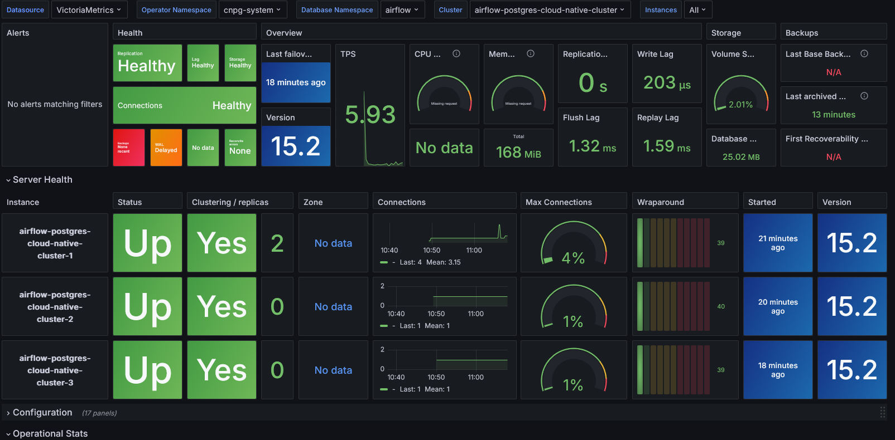

# Purpose
The purpose of this module is to deploy the `Cloudnative PG` helm chart <https://github.com/cloudnative-pg/charts/tree/main/charts/cluster>.
This will deploy both the database.

Along with the deployment of the database a dashboard is also installed in Grafana to
get an overview of the health of the database cluster. It will look like:

