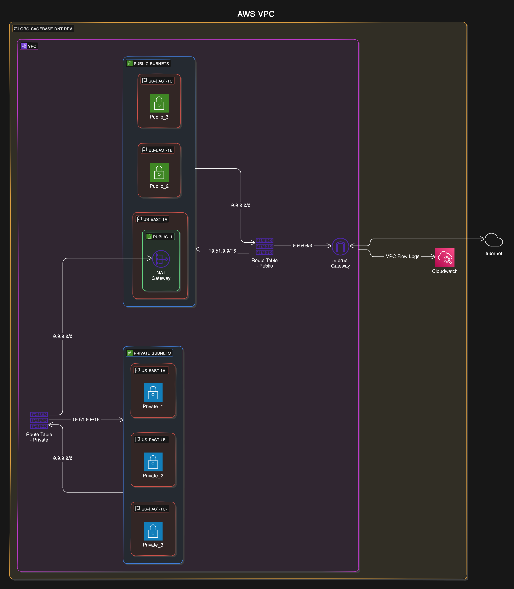
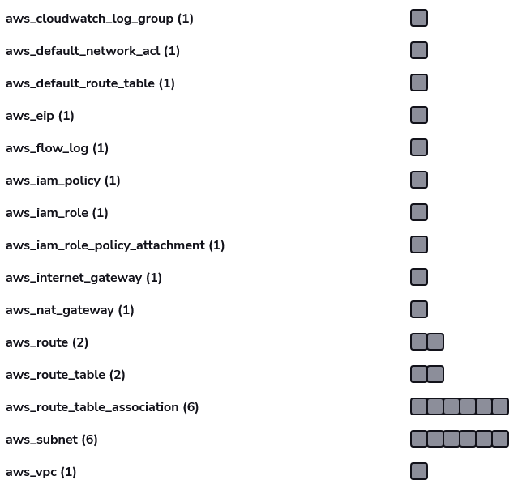

# Purpose
This module is used to provision a VPC within AWS.

## Resources provisioned during creation
The following is the network topology of the created AWS VPC. Some resources like IAM
roles for access to publish flow logs are omitted.

This diagram describes the VPC deployed to the `org-sagebase-dnt-dev` AWS account. It
is deployed to a specific CIDR block across 3 AZs that contain a private/public subnet
each.



Terraform resources as shown in the Spacelift UI:



<!-- VPC Topology created on : https://app.eraser.io

Code:
```
title AWS VPC

org-sagebase-dnt-dev [icon: aws] {
  Cloudwatch [icon: aws-cloudwatch]
  VPC [icon: aws-vpc] {
    Route Table - Private [icon: aws-route-table]
    Route Table - Public [icon: aws-route-table]
    Public Subnets [icon: aws-subnet] {
      us-east-1a [icon: aws-availability-zone] {
        Public_1 [icon: aws-public-subnet] {
          NAT Gateway [icon: aws-nat-gateway]
        }
      }
      us-east-1b [icon: aws-availability-zone] {
        Public_2 [icon: aws-public-subnet]
      }
      us-east-1c [icon: aws-availability-zone] {
        Public_3 [icon: aws-public-subnet]
      }
    }
    Private Subnets [icon: aws-subnet] {
      us-east-1a- [icon: aws-availability-zone] {
        Private_1 [icon: aws-private-subnet]
      }
      us-east-1b- [icon: aws-availability-zone] {
        Private_2 [icon: aws-private-subnet]
      }
      us-east-1c- [icon: aws-availability-zone] {
        Private_3 [icon: aws-private-subnet]
      }
    }
    Internet Gateway [icon: aws-internet-gateway]
  }
}


// Connections
VPC > Cloudwatch: VPC Flow Logs
Internet Gateway <> Internet [icon: cloud]
"Route Table - Private" > NAT Gateway: "0.0.0.0/0"
Private Subnets > "Route Table - Private": "0.0.0.0/0"
"Route Table - Private" > Private Subnets: "10.51.0.0/16"

Public Subnets > "Route Table - Public": "0.0.0.0/0"
"Route Table - Public" > Public Subnets: "10.51.0.0/16"
"Route Table - Public" > Internet Gateway: "0.0.0.0/0"
```

Provisioned Resources is a screenshot from the spacelift UI -->


### Attaching to the Sage Transit Gateway
The Transit Gateway is a planned feature but has not yet been implemented into this
VPC module.


Attaching the VPC to the Sage Transit Gateway is managed through the central IT 
repository using the following documentation:

* <https://github.com/Sage-Bionetworks-IT/organizations-infra/tree/master/org-formation/710-tgw>
* <https://github.com/Sage-Bionetworks-IT/organizations-infra/tree/master/org-formation/720-client-vpn>

See this example pull-request for adding a VPC spoke:
<https://github.com/Sage-Bionetworks-IT/organizations-infra/pull/1182>