# Snowflake S3 Bucket Module

This module creates an S3 bucket with a KMS key for SSE-KMS encryption, and appropriate IAM roles and policies for Snowflake integration, including cross-account replication support.
## Architecture Flow

The following diagram shows the resource dependency flow within this module:

```mermaid
graph TD
    %% Step 1 - Independent resources
    A[aws_kms_key.rds_export_key<br/>Step 1] 
    C[aws_s3_bucket.bucket<br/>Step 1]
    H[aws_iam_role.snowflake_role<br/>Step 1]
    
    %% Step 2 - Resources dependent on Step 1
    A --> B[aws_kms_alias.rds_export_key<br/>Step 2]
    C --> D[aws_s3_bucket_ownership_controls.ownership<br/>Step 2]
    C --> E[aws_s3_bucket_public_access_block.access_block<br/>Step 2]
    C --> J[aws_s3_bucket_versioning.versioning<br/>Step 2]
    C --> K[aws_s3_bucket_policy.replication_destination_policy<br/>Step 2]
    A --> G[aws_iam_policy.snowflake_s3_access_policy<br/>Step 2]
    C --> G
    
    %% Step 3 - Resources dependent on Step 2
    D --> F[aws_s3_bucket_acl.bucket_acl<br/>Step 3]
    E --> F
    K --> L[aws_s3_bucket_server_side_encryption_configuration.encryption<br/>Step 3]
    A --> L
    G --> I[aws_iam_role_policy_attachment.snowflake_policy_attachment<br/>Step 3]
    H --> I
    
    %% Styling by step
    style A fill:#e1f5fe
    style C fill:#e8f5e8
    style H fill:#fff3e0
    
    style B fill:#e1f5fe
    style D fill:#e8f5e8
    style E fill:#e8f5e8
    style J fill:#e8f5e8
    style K fill:#e8f5e8
    style G fill:#fff3e0
    
    style F fill:#fce4ec
    style L fill:#fce4ec
    style I fill:#fce4ec
```



## Resource Execution Steps

**Step 1 (Independent):**
- `aws_kms_key.rds_export_key` - KMS key creation
- `aws_s3_bucket.bucket` - S3 bucket creation  
- `aws_iam_role.snowflake_role` - IAM role creation

**Step 2 (Dependent on Step 1):**
- `aws_kms_alias.rds_export_key` - KMS alias (needs key)
- `aws_s3_bucket_ownership_controls.ownership` - Ownership controls (needs bucket)
- `aws_s3_bucket_public_access_block.access_block` - Public access block (needs bucket)
- `aws_s3_bucket_versioning.versioning` - Bucket versioning (needs bucket)
- `aws_s3_bucket_policy.replication_destination_policy` - Bucket policy (needs bucket)
- `aws_iam_policy.snowflake_s3_access_policy` - IAM policy (needs bucket + KMS key)

**Step 3 (Dependent on Step 2):**
- `aws_s3_bucket_acl.bucket_acl` - Bucket ACL (needs ownership + access block)
- `aws_s3_bucket_server_side_encryption_configuration.encryption` - Encryption config (needs bucket policy + KMS key)
- `aws_iam_role_policy_attachment.snowflake_policy_attachment` - Policy attachment (needs role + policy)
## Usage

```hcl
module "snowflake_bucket" {
  source = "../modules/snowflake-s3-bucket"
  
  bucket_name              = "my-snowflake-bucket"
  aws_account_id          = "123456789012"
  region                  = "us-east-1"
  source_account_id       = "987654321098"
  source_bucket_arn       = "arn:aws:s3:::source-bucket"
  snowflake_principal_arn = "arn:aws:iam::365909334157:user/snowflake-user"
  snowflake_external_id   = "your-snowflake-external-id"
  
  tags = {
    Environment = "prod"
    Purpose     = "snowflake-integration"
  }
}
```

## Snowflake Configuration Requirements

### Obtaining Snowflake Credentials

The `snowflake_principal_arn` and `snowflake_external_id` values must be obtained from your Snowflake setup.

To get these values:

1. **Snowflake Principal ARN**: This is provided by Snowflake when you configure the storage integration. It typically follows the pattern `arn:aws:iam::365909334157:user/[snowflake-generated-username]`.

2. **Snowflake External ID**: This is a unique identifier generated by Snowflake for secure cross-account access. It's provided when you create a storage integration in Snowflake.

**Important**: 
- These values are sensitive and should be treated as secrets
- Never commit hardcoded values to version control
- Use secure parameter management (e.g., AWS Systems Manager Parameter Store, HashiCorp Vault) in production
- The `snowflake_external_id` is marked as sensitive and will not appear in Terraform logs

### Setting up Snowflake Storage Integration

1. In Snowflake, create a storage integration:
```sql
CREATE STORAGE INTEGRATION my_s3_integration
  TYPE = EXTERNAL_STAGE
  STORAGE_PROVIDER = S3
  ENABLED = TRUE
  STORAGE_AWS_ROLE_ARN = 'arn:aws:iam::<AWS_ACCOUNT_ID>:role/snowflake-role'
  STORAGE_ALLOWED_LOCATIONS = ('s3://your-bucket-name/*');
```

2. Get the integration details:
```sql
DESC INTEGRATION my_s3_integration;
```

This will provide you with the `STORAGE_AWS_IAM_USER_ARN` (use for `snowflake_principal_arn`) and `STORAGE_AWS_EXTERNAL_ID` (use for `snowflake_external_id`).

## Requirements

| Name | Version |
|------|---------|
| terraform | >= 1.0 |
| aws | >= 4.0 |

## Variables

| Name | Description | Type | Default | Required |
|------|-------------|------|---------|:--------:|
| bucket_name | Name of the S3 bucket | `string` | n/a | yes |
| aws_account_id | AWS account ID where S3 resources will be created | `string` | n/a | yes |
| region | AWS region for S3 bucket | `string` | `"us-east-1"` | no |
| enable_versioning | Enable versioning on the S3 bucket | `bool` | `true` | no |
| source_account_id | AWS account ID that will replicate TO this bucket | `string` | n/a | yes |
| source_bucket_arn | ARN of the source bucket that will replicate to this bucket | `string` | n/a | yes |
| snowflake_principal_arn | ARN of the Snowflake principal (user or role) that will assume the role | `string` | n/a | yes |
| snowflake_external_id | The externald ID that Snowflake uses to establish a trust relationship with AWS. You must specify the same external ID in the trust policy of the IAM role that you configured for this storage integration. <br> <br>This can be retrieved on Snowflake via the SQL command `DESC STORAGE INTEGRATION <integration_name>`. | `string` | n/a | yes |
| tags | Additional tags for the S3 bucket | `map(string)` | `{}` | no |
| public_access | Enable public access to the bucket | `bool` | `false` | no |
| enable_cors | Enable CORS configuration | `bool` | `false` | no |

## Outputs

See [outputs.tf](outputs.tf) for available outputs.
