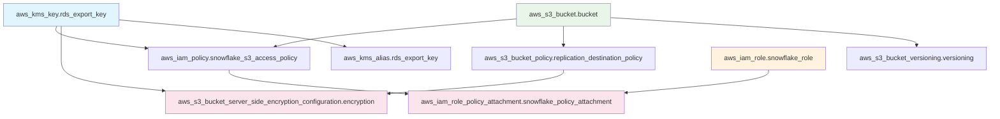

# Snowflake S3 Bucket Module

This module creates an S3 bucket with a KMS key for SSE-KMS encryption, and appropriate IAM roles and policies for Snowflake integration, including cross-account replication support.
## Architecture Flow

The following diagram shows the resource dependency flow within this module:



## Resource Flow Description

1. **KMS Key Creation**: Creates the customer-managed KMS key for encryption
2. **S3 Bucket Creation**: Creates the destination bucket for Snowflake data
3. **Bucket Configuration**: Sets up versioning and bucket policy for cross-account access
4. **Encryption Setup**: Configures bucket encryption using the KMS key (depends on both bucket policy and KMS key)
5. **IAM Resources**: Creates Snowflake access policy and role, then attaches them
## Usage

```hcl
module "snowflake_bucket" {
  source = "../modules/snowflake-s3-bucket"
  
  bucket_name              = "my-snowflake-bucket"
  aws_account_id          = "123456789012"
  region                  = "us-east-1"
  source_account_id       = "987654321098"
  source_bucket_arn       = "arn:aws:s3:::source-bucket"
  snowflake_principal_arn = "arn:aws:iam::365909334157:user/snowflake-user"
  snowflake_external_id   = "your-snowflake-external-id"
  
  tags = {
    Environment = "prod"
    Purpose     = "snowflake-integration"
  }
}
```

## Snowflake Configuration Requirements

### Obtaining Snowflake Credentials

The `snowflake_principal_arn` and `snowflake_external_id` values must be obtained from your Snowflake setup.

To get these values:

1. **Snowflake Principal ARN**: This is provided by Snowflake when you configure the storage integration. It typically follows the pattern `arn:aws:iam::365909334157:user/[snowflake-generated-username]`.

2. **Snowflake External ID**: This is a unique identifier generated by Snowflake for secure cross-account access. It's provided when you create a storage integration in Snowflake.

**Important**: 
- These values are sensitive and should be treated as secrets
- Never commit hardcoded values to version control
- Use secure parameter management (e.g., AWS Systems Manager Parameter Store, HashiCorp Vault) in production
- The `snowflake_external_id` is marked as sensitive and will not appear in Terraform logs

### Setting up Snowflake Storage Integration

1. In Snowflake, create a storage integration:
```sql
CREATE STORAGE INTEGRATION my_s3_integration
  TYPE = EXTERNAL_STAGE
  STORAGE_PROVIDER = S3
  ENABLED = TRUE
  STORAGE_AWS_ROLE_ARN = 'arn:aws:iam::<AWS_ACCOUNT_ID>:role/snowflake-role'
  STORAGE_ALLOWED_LOCATIONS = ('s3://your-bucket-name/*');
```

2. Get the integration details:
```sql
DESC INTEGRATION my_s3_integration;
```

This will provide you with the `STORAGE_AWS_IAM_USER_ARN` (use for `snowflake_principal_arn`) and `STORAGE_AWS_EXTERNAL_ID` (use for `snowflake_external_id`).

## Requirements

| Name | Version |
|------|---------|
| terraform | >= 1.0 |
| aws | >= 4.0 |

## Variables

| Name | Description | Type | Default | Required |
|------|-------------|------|---------|:--------:|
| bucket_name | Name of the S3 bucket | `string` | n/a | yes |
| aws_account_id | AWS account ID where S3 resources will be created | `string` | n/a | yes |
| region | AWS region for S3 bucket | `string` | `"us-east-1"` | no |
| enable_versioning | Enable versioning on the S3 bucket | `bool` | `true` | no |
| source_account_id | AWS account ID that will replicate TO this bucket | `string` | n/a | yes |
| source_bucket_arn | ARN of the source bucket that will replicate to this bucket | `string` | n/a | yes |
| snowflake_principal_arn | ARN of the Snowflake principal (user or role) that will assume the role | `string` | n/a | yes |
| snowflake_external_id | External ID for Snowflake role assumption | `string` | n/a | yes |
| tags | Additional tags for the S3 bucket | `map(string)` | `{}` | no |
| public_access | Enable public access to the bucket | `bool` | `false` | no |
| enable_cors | Enable CORS configuration | `bool` | `false` | no |

## Outputs

See [outputs.tf](outputs.tf) for available outputs.