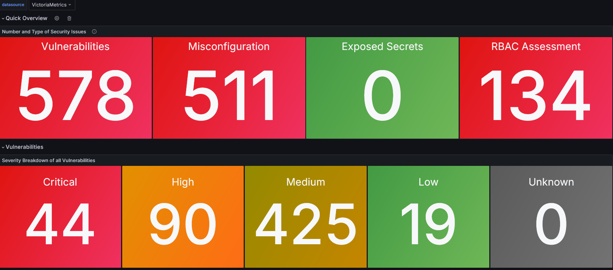
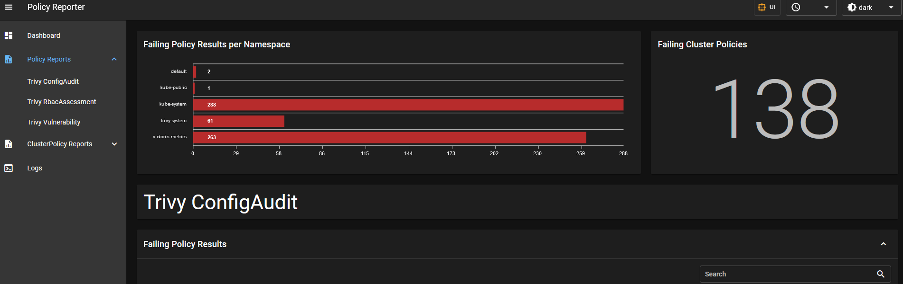

# Purpose

This module is used to deploy the trivy operator k8s helm chart.

The Trivy Operator leverages Trivy to continuously scan your Kubernetes cluster for 
security issues. The scans are summarised in security reports as Kubernetes Custom 
Resource Definitions, which become accessible through the Kubernetes API. The Operator 
does this by watching Kubernetes for state changes and automatically triggering 
security scans in response. For example, a vulnerability scan is initiated when a new 
Pod is created. This way, users can find and view the risks that relate to different 
resources in a Kubernetes-native way.

This module is responsible for installing 3 charts:

- Scanner that regularly scans for vulnerabilities: `trivy-operator` from <https://aquasecurity.github.io/helm-charts/>
- Convert trivy CRDs into policy-reporter <https://fjogeleit.github.io/trivy-operator-polr-adapter>
- A UI to easily view the scan results <https://kyverno.github.io/policy-reporter>

## Getting an overview of trivy results

Results are provided in a grafana dashbaord that is scraped from the operator `/metrics`
endpoint. The dashboard looks like:

## Viewing more detailed information about the vulnerabilities
Data from trivy is converted over into resources that a tool called `policy-reporter`
can understand. It has a UI built on top of those resources which allow you to view
what the scans are telling you. In order to get access to the UI create a port forward
session to the UI in the `trivy-system` namespace.

### Viewing the most detailed information
Tivy creates CRDs (Custom resource definitions) that store all of the information that
it collected. You are able to view this information as a kubernetes resource through
`kubectl` commands or `k9s`. Read more on these CRDs here <https://aquasecurity.github.io/trivy-operator/v0.22.0/docs/crds/>.
