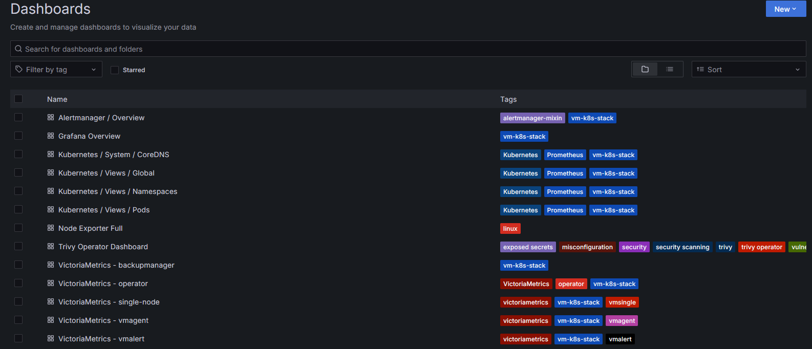
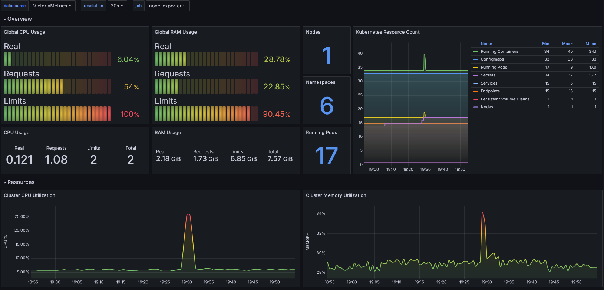
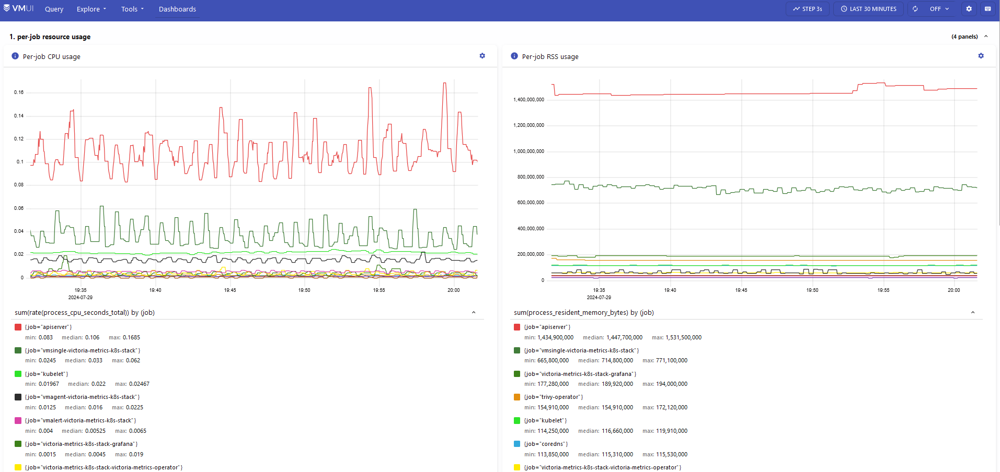

# Purpose
This module is used to deploy the victoria metrics k8s helm chart.


This module is an All-in-one solution to start monitoring a kubernetes cluster.


It installs multiple dependency charts like grafana, node-exporter, kube-state-metrics 
and victoria-metrics-operator. Also it installs Custom Resources like VMSingle, 
VMCluster, VMAgent, VMAlert.


When installed this module will add a time series database (Victoria Metrics) along with
the required agents to support scraping for prometheus metrics from a number of data
sources.

Resources:

- <https://github.com/VictoriaMetrics/helm-charts/tree/master/charts/victoria-metrics-k8s-stack>

## Description
This deployment is running in single-server mode. It also may be updated to run in
cluster mode, however, there are many additional considerations for cluster mode. That
includes the need to run multiple nodes, a different data storage medium (Preventing
easily swapping from single -> cluster)

## Screenshots of the tool

Default grafana dashboards:



<br>

Cluster resource utilization:



<br>

Victoria metrics UI to explore prometheus metrics:



<br>

## Creating a custom service scrape
When adding more services to the k8s cluster you will want to determine if the service
supports prometheus metric collection. If it does you will want to add a scrape config
that instructs VM to collect metric data from it. For example this terraform config is
used within the trivy operator to export metric data:

```
resource "kubernetes_manifest" "vmservicescrape" {
  manifest = {
    apiVersion = "operator.victoriametrics.com/v1beta1"
    kind       = "VMServiceScrape"
    metadata = {
      name      = "trivy-vmservicescrape"
      namespace = kubernetes_namespace.trivy-system.metadata[0].name
    }
    spec = {
      endpoints = [
        {
          port = "metrics"
        }
      ]
      selector = {
        matchLabels = {
          "app.kubernetes.io/name" = "trivy-operator"
        }
      }
    }
  }
}
```

## Adding more grafana dashboards from grafana.com
Within the `values.yaml` define within the templates file you may add the ID of
additional dashboard you'd like to install with the grafana deployment. Add it to 
`grafana.dashboards.default`.

## Accessing the grafana dashboards
Access to the dashboards is only currently supported by setting up a port-forward
through kubectl commands. Find the `grafana` pod running in the `victoria-metrics`
namespace and start a port-forward session. The default admin password is stored as a
secret named `victoria-metrics-k8s-stack-grafana`.

### Future work
- Update the module to allow passing in additional dashboards as a variable.
- Update the module and `values.yaml` to allow creating dashboards via json configuration.
- Implementing a backup mechanism <https://docs.victoriametrics.com/vmbackup/> or move to a managed instance of the time series database.
- User accounts for access to resources
- Integration with a secret storage backend (Like vault) to handle rotating secrets